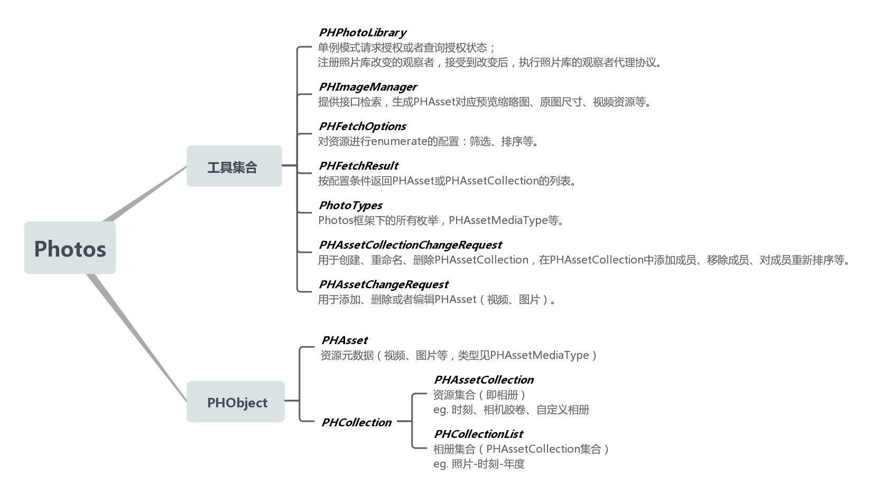
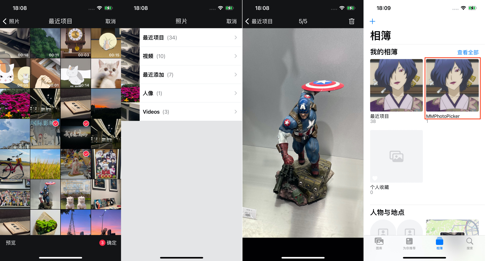

# MMPhotoPicker

[](http://cocoapods.org/pods/MMPhotoPicker)&nbsp;
[](https://www.apple.com/nl/ios/)&nbsp;
[](http://cocoapods.org/pods/MMPhotoPicker)&nbsp;
[](https://raw.githubusercontent.com/ChellyLau/MMPhotoPicker/master/LICENSE)&nbsp;


`MMPhotoPicker`基于`Photos`框架，集成了视频&图片选择器以及创建自定义相册，并保存视频、图片到自定义相册。


## Photos框架简述



## 属性

```objc
MMPhotoPickerController属性介绍：
   
// 是否显示视频 [默认NO]
@property (nonatomic, assign) BOOL showVideo;
// 最大选择数目[默认9张、如果显示视频，也包括视频数量]
@property (nonatomic, assign) NSInteger maximumNumber;

// 主色调[默认红色#FC2948]
@property (nonatomic, strong) UIColor *mainColor;
// 未选中图片[用于是否选择原图标记]
@property (nonatomic, strong) UIImage *unselectIcon;
// 选中图片[用于是否选择原图标记、图片选择标记]
@property (nonatomic, strong) UIImage *selectIcon;

// 代理
@property (nonatomic, assign) id<MMPhotoPickerDelegate> delegate;

```

## 代理

```objc
@protocol MMPhotoPickerDelegate <NSObject>

@optional

/**
 info释义:
 返回的媒体数据是数组，数组单元为字典，字典中包含以下数据：

 资源类型 MMPhotoMediaType
 地理位置 MMPhotoLocation
 图片方向 MMPhotoOrientation
 原始图片 MMPhotoOriginalImage
 视频路径 MMPhotoVideoURL
 视频时长 MMPhotoVideoDuration
 */
- (void)mmPhotoPickerController:(MMPhotoPickerController *)picker didFinishPickingMediaWithInfo:(NSArray<NSDictionary *> *)info;
- (void)mmPhotoPickerControllerDidCancel:(MMPhotoPickerController *)picker;

@end

```
  
## 使用

1. `pod "MMPhotoPicker"` ;
2. `pod install` / `pod update`;
3. `#import <MMPhotoPicker/MMPhotoPickerController.h>`.

```objc
MMPhotoPickerController * controller = [[MMPhotoPickerController alloc] init];
controller.delegate = self;
controller.showVideo = YES;
controller.maximumNumber = 12;
 
UINavigationController * navigation = [[UINavigationController alloc] initWithRootViewController:controller];
[self.navigationController presentViewController:navigation animated:YES completion:nil];
```

```objc
#pragma mark - MMPhotoPickerDelegate
- (void)mmPhotoPickerController:(MMPhotoPickerController *)picker didFinishPickingMediaWithInfo:(NSArray *)info
{
     NSLog(@"%@",info);
}

- (void)mmPhotoPickerControllerDidCancel:(MMPhotoPickerController *)picker
{
     NSLog(@"Cancel");
}
```

## 保存视频/图片到自定义相册

```objc
MMPhotoUtil类中：

// 保存图片
+ (void)saveImage:(UIImage *)image completion:(void(^)(BOOL success))completion;
// 保存视频
+ (void)saveVideo:(NSURL *)videoURL completion:(void(^)(BOOL success))completion;

```

## 注意

1. 需要在Info.plist中添加隐私授权：`Privacy - Photo Library Usage Description`；
2. 如果相册名称需要根据手机语言环境显示相应语言，需要在Info.plist中设置`Localized resources can be mixed` 为 `YES`。

## 效果图




